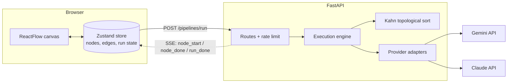
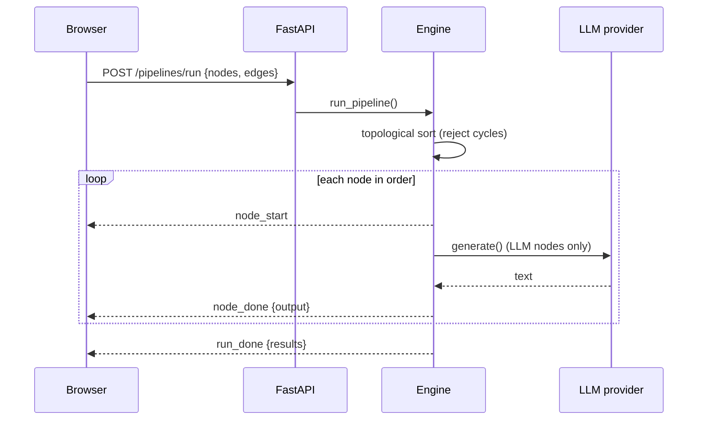

# FlowForge

**Design LLM pipelines on a canvas, validate them as a DAG, and run them with Gemini or Claude.** Results stream back node by node.

   

<!-- Add a demo GIF here: docs/demo.gif -->

**Live demo:** _coming soon_

## What it does
- Drag nodes (Input, Text Template, LLM, Output, and more) onto a canvas and wire them together.
- `{{variables}}` in a Text node create input handles automatically.
- **Validate** checks the graph is a DAG (no cycles) and reports node and edge counts.
- **Run** executes the graph in topological order. Each node lights up as it runs and shows its output; LLM nodes call Gemini or Claude.
- Bring your own API keys, or use the rate-limited demo key.

## Architecture



### Run lifecycle



## Design decisions
- **Server-sent events over WebSockets.** Execution is one-way (server to client), so SSE is simpler, works through proxies, and reconnects cleanly. The client reads the stream with `fetch` because `EventSource` is GET-only.
- **Kahn's algorithm for ordering and cycle detection.** One pass gives both the execution order and the cycle check, and unlike recursive DFS it can't hit the recursion limit on large graphs.
- **Pure graph module, thin engine.** `graph.py` has no I/O and is unit tested; `engine.py` takes a key resolver as a callback, so tests inject fakes and never touch the network.
- **Provider adapters over plain REST (`httpx`).** No vendor SDKs to pin, and adding a provider is one function.
- **Keys never touch the repo or logs.** The browser sends keys only with a run request (held in session storage); the server falls back to env-var keys behind a per-IP rate limit.
- **One `BaseNode` for every node type.** Cards, handles, delete and run-status rendering live in one place, and each node supplies only its fields.
- **Node config lives in the store, not component state,** so the backend receives exactly what is on screen.

## Run locally

```bash
# backend (http://localhost:8000)
cd backend
cp .env.example .env              # add GEMINI_API_KEY and/or ANTHROPIC_API_KEY
pip install -r requirements.txt
uvicorn main:app --reload

# frontend (http://localhost:3000)
cd frontend
cp .env.example .env
npm install
npm start
```

Or run the backend in Docker: `docker compose up --build`.

Tests: `cd backend && pip install -r requirements-dev.txt && pytest`

## API

| Method | Path | Purpose |
|---|---|---|
| GET | `/models` | Supported model labels |
| POST | `/pipelines/parse` | Node/edge counts and `is_dag` |
| POST | `/pipelines/run` | Execute the graph; streams SSE events |

## Known limitations and roadmap
- API, Database, Filter, Validator and Transform nodes are UI-only for now; the engine passes their input through.
- Rate limiting is in-memory, per instance. A shared store (Redis) is needed to scale out.
- Save/load pipelines, parallel execution of independent branches, and per-node retries are next.

## Docs
- [Architecture notes](docs/architecture.md)
- [Demo script](docs/demo_script.md)

## License
MIT
